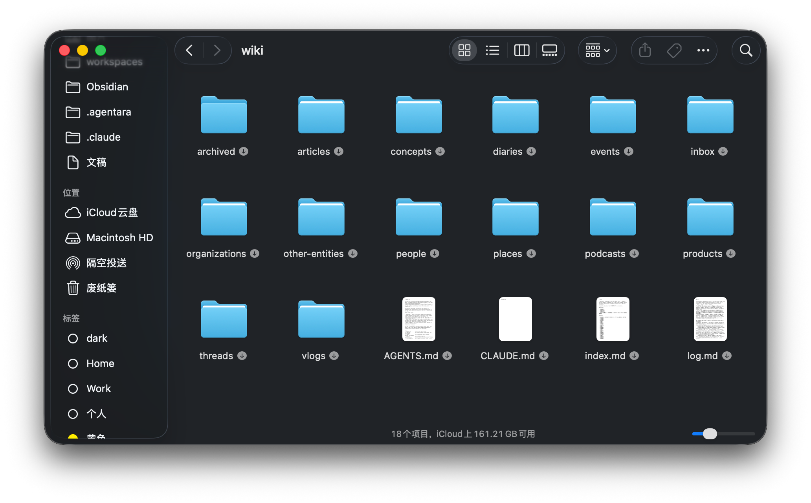
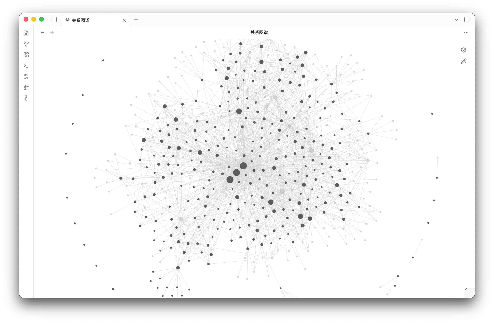

# Harness 101：Company Brain

> 来源: 飞书云文档 (O1Fudqn5QoaqUpxoX8IcfG87nOc)

---

## 前言

我有一个有点暴露的私人愿望：希望 90 岁那年能把自己的意识上传。但 90 岁的我已经记不清 40 岁的味道了——上传一具褪色的脑子没什么意义。我真正想保留的，是现在 40 多岁的我，对人的看法、对生活的活力、对 AI 工作激情和对技术的热情。

所以春节开始，我着手打造我人生的知识库，从我 3 岁的记忆开始整理起，通过与 OpenClaw 对话整理我人生中遇见的人、做过的事儿和思考，然后形成带有 Wikilink 的 Obsidian 标准的文件夹：是不是该给自己造一个 LLM Wiki / 私人知识图谱——一种能让未来的我把过去重新读出来的、活的知识库？

你知道吗——什么是LLM Wiki？
一种以 LLM 作为读 / 写 / 维护主体的活知识库：它能自动 ingest 各类原始材料，抽取实体与关系，按角色与权限合成回答，而不是像传统 Wiki 那样靠人手工编辑、结构静态。它目前还是一个仍在演化中的工程范畴，社区还没有统一定义，不同团队心里画的样子不太一样。

但**「私人版到底怎么造」这件事，我先按下不表，值得另写一篇。真正让我开始严肃思考这件事的，是朋友最近推给我的一个系列——X 上爆火的 Company Brain 三部曲（Part 1/Part 2/Part 3）。三篇读下来我才意识到：作者写的是公司级的知识库，但他构建的那套 记忆基质（Memory Substrate） 思想，几乎就是我心里那个 LLM Wiki 应该长成的样子——只不过他把它放大到了一个组织的尺度**。

- [Company Brain: Why Most Companies Have Data But No Memory](https://x.com)
- [Company Brain, Part 2: Factual Memory](https://x.com)
- [Company Brain, Part 3: Interaction Memory](https://x.com)

标题里那句「companies have data but no memory」很抓人。因为它把今天很多 AI Agent 项目里一个说不清、但人人都隐隐感觉不对劲的问题挑明了：公司不是没有数据，公司是没有记忆。

数据在 Slack 里，决策在会议里，客户承诺在邮件里，风险在某个工单评论里，真实的 tradeoff 在两个负责人下班路上的电话里。三个月后，新同事问「为什么当时这么做」，我们通常只能翻出一个 artifact：PRD、ticket、dashboard、meeting notes。但 artifact 只是决策的尸体。

真正活着的是它之前的那段过程：谁提出了反对意见、哪个假设最脆弱、为什么最后没有选另一个方案、哪个客户承诺其实只是口头说了一句、哪个风险当时被低估了。

笔者读完这三篇后最大的感受是：Company Brain 不是一个更聪明的企业搜索，也不是一个套在公司文档上的 chatbot，而是 Agent 时代的组织记忆系统。如果没有这层记忆，Agent 只能在碎片数据上做动作；看起来自动化了，实际上是在没有上下文的地面上高速奔跑。

本文试图把这三篇文章重新整理成一个更偏工程视角的模型：Company Brain 到底要记什么？为什么 RAG 不够？factual memory、interaction memory、action memory 三层各自解决什么问题？如果今天要做一个最小版本，架构应该长什么样？

---

## 公司为什么没有大脑

我们先拆一个最常见的错觉：把数据连起来，就等于公司有了记忆。

这也是很多「企业 AI」方案最容易滑进去的地方。第一步接 Slack，第二步接 Google Drive，第三步接 Jira，第四步接 CRM，然后做一个 unified search，再加一个对话框。Demo 当然会很惊艳：问一句「某客户最近有什么问题」，系统能把几个相关文档和工单拉出来。

但这还不是 memory。它最多是 retrieval。

> Retrieval 回答的是：哪段文字可能相关？
> Memory 回答的是：这件事在组织里意味着什么？

这两个问题看起来相近，其实差很远。一个客户在电话里说「我们可以等到下个季度」，搜索系统会把这句话找出来；真正的 Company Brain 要知道，这句话对销售来说可能是续约风险，对产品来说可能是需求优先级，对工程来说可能是交付窗口，对 CEO 来说可能是战略信号。

同一句话，落到不同角色、不同时间、不同上下文里，含义完全不同。

所以原文里最值得抓住的不是「brain」这个营销感很强的词，而是 memory substrate 这个更朴素的词。Substrate 是基质，是底层承载物。一个公司要想让 Agent 真正进入工作流，先要有一个能承载事实、上下文、推理与行动的基质。

> **你知道吗——Organizational Memory？**
> Organizational Memory 通常指组织从历史中保留下来的信息，并且这些信息能影响当下决策。这里的重点不是「存下来」，而是「能被带回决策现场」。一份没人知道、没人信、没人敢用的文档，不是组织记忆，只是组织化石。

换句话说，Company Brain 的核心不是「让公司可搜索」，而是让公司不失忆。

---

## 三层记忆

三篇文章里最重要的骨架，是把 Company Brain 拆成三层：

- **Factual Memory**：发生了什么 / 来源是谁 / 谁拥有 / 何时变更
- **Interaction Memory**：为什么这样决定 / Artifacts 诞生之前那段对话长什么样
- **Action Memory**：协调下一步——什么时候推进、等待、求助、上报、停止

这三层很像人的记忆系统。我们不是只记事实。我们会把事实放进关系里、放进情绪里、放进当时的判断里，然后在下次遇到类似场景时改变行为。

公司也是这样。一个公司如果只能记住「客户要求 SSO」，它只是有事实；如果能记住「客户为什么要求 SSO、当时谁承诺了、工程为什么反对、最后选择了哪个折中方案」，它才开始有记忆；如果还能在下一次类似客户电话前主动提醒「这类承诺过去踩过坑，先确认法务和交付窗口」，它才开始有行动协调能力。

这也是笔者觉得 Company Brain 这组文章有启发的地方：它没有把 Agent 当成起点，而是把 Agent 放回了组织系统里。Agent 不是凭空工作的。它的任务从人类对话里来，它的约束从组织记忆里来，它的安全边界从权限和上下文里来。

如果没有这三层，Agent 只能做两类事：
- 在碎片里检索：找得到，但不一定懂。
- 在工具上执行：做得到，但不一定该做。

真正难的是中间那层：Agent 要知道某个事实为什么重要、哪个判断已经过期、哪个承诺是正式的、哪个只是会议里随口一说。

---

## 事实记忆（Factual Memory）

Factual Memory 是第一层，也最容易被低估。因为它听起来像一个数据工程问题：把所有东西接进来，打索引，加权限，然后能搜。

但原文 Part 2 反复强调：factual memory 不是 shared drive，不是 wiki，不是 enterprise search 加一个 chat box。

它至少要有这几个字段：
- **source**：这条事实来自哪里？会议转写、邮件、CRM、工单，还是某个 dashboard？
- **owner**：谁对它负责？个人、团队，还是某个正式流程？
- **timestamp**：它是什么时候产生、什么时候被更新、什么时候变旧的？
- **permission**：谁能看原文？谁只能看 summary？谁不能知道它存在？
- **freshness**：它现在还有效吗？有没有被更新的事实覆盖？
- **confidence**：系统对这条抽取的事实有多确定？
- **relationship**：它连接到哪些客户、项目、承诺、风险、决策？

其中最关键的是 provenance。没有 provenance 的事实，是一条孤立的断言；有 provenance 的事实，才是可审计、可回放、可质疑的记忆。

> **你知道吗——Provenance？**
> Provenance 原本常见于档案学、博物馆和数据工程，关注一件东西的来源、流转和变更历史。放在 Company Brain 里，它回答的是：「这条事实从哪里来、是谁确认的、什么时候变成公司记忆的、后来有没有被推翻？」

一个最小的事实节点，大概会长这样：

```yaml
type: customer_commitment
customer: Acme
commitment: "周五前交付 beta 版本"
status: conditional
conditions:
  - legal_signoff
  - beta_limitation_accepted
owner: sales_team
related_project: billing_rewrite
source:
  kind: meeting
  path: meetings/2026-05-06-acme-renewal.md
  lines: 120-148
confidence: 0.82
created_at: 2026-05-06T15:40:00Z
freshness: active
permissions:
  raw_transcript: sales_and_product
  summary: company_internal
```

注意这里的重点不是 YAML 本身，而是 artifact 周围的关系。一条客户承诺不是孤立文本，它至少连接了客户、项目、负责人、条件、风险、原始对话、后续 ticket。

这就是为什么单纯 RAG 不够。Embedding 很擅长从一堆文本里找相似片段，但它不天然知道「这条承诺被哪个新事实覆盖了」「这个 owner 已经换人了」「这条信息对 IC 和 CEO 应该呈现不同层级」。

笔者更倾向于把这一层想成一个 semantic file system + context graph：
- **semantic file system** 负责让 artifact 有类型、有元数据、有稳定路径。
- **context graph** 负责让 artifact 之间的关系可遍历、可解释、可更新。
- **retrieval** 负责召回候选材料。
- **graph expansion** 负责把候选材料放回组织上下文里。

> **题外话：Semantic File System？**
> Semantic File System 的直觉是：文件不只是路径里的 blob，而是带语义、关系和可查询属性的对象。在 LLM 时代，这个想法重新变得实用——因为 markdown、frontmatter、wikilink、embedding、graph traversal 可以组合成一个低成本的 memory substrate。

一个好的 factual memory 层，不只是回答「这个客户说过什么」，而是回答：这个客户说过什么、这句话当时意味着什么、谁负责、证据在哪里、现在还可信吗？

---

## 交互记忆（Interaction Memory）

如果 factual memory 解决「发生了什么」，interaction memory 解决的就是「为什么这样决定」。

这层是三篇文章里笔者最喜欢的部分。原文 Part 3 开篇说，几乎所有重要的公司事情都发生在 meeting、message、email 里。听起来夸张，但我们只要回想一下真实工作就知道：绝大多数决定不是在数据库里做出来的。

> 数据库记录的是 aftermath。

真正的决定发生在对话里：
- 客户电话里，销售承诺了一个 workaround。
- 架构会上，工程说「可以，但前提是这个假设成立」。
- Slack 里，负责人五分钟内改了优先级。
- 邮件里，法务给了一个带条件的 approve。
- 会议结束前，有人没有明确反对，但沉默本身就是一个信号。

等这些东西变成 ticket、PRD、roadmap note 的时候，很多「为什么」已经被压缩掉了。

这也是 interaction memory 的目标：不是保存 transcript，而是保存意义的生成过程。

这里有一个核心词：**ontology**。Ontology 决定系统把一句话识别成什么：decision、commitment、objection、risk、dependency、assumption、owner、open question。

同一句话，在不同 ontology 下会变成不同结构。原文里那个例子很典型：

> 「我们可以周五发，如果法务签字，而且 Acme 接受 beta 限制。」

Transcript 只会存一句话。Summary 可能写成「团队讨论了周五发布」。但 interaction memory 应该读出下面这些结构。

> **你知道吗——Ontology？**
> Ontology 在这里不是哲学课里的玄学，而是一组「系统用来理解世界的概念和关系」。同一句会议发言，如果被识别成 commitment，后续就会进入 follow-up；如果被识别成 objection，就会进入风险图谱；如果被识别成 assumption，就要等待验证。

Interaction Memory 真正困难的地方在于：它离人太近了。

记少了，公司继续失忆；记多了，系统会变得吵，甚至有 surveillance 的味道。不是所有话都应该成为公司记录，不是所有私人想法都应该进入组织记忆，不是所有 transcript 都应该对所有人可见。

所以这层的产品和工程边界都很硬：
- 有些 interaction 只能抽象成 aggregate signal，不能暴露原文。
- 有些 meeting 可以生成 summary，但不能让跨团队的人看 transcript。
- 有些 private note 可以参与个人 memory，但不能自动变成 company memory。
- 有些 disagreement 应该保留为 dissenting view，而不是被 summary 抹平。

笔者认为，这里会是 Company Brain 最难、也最值钱的地方。因为公司真正的「为什么」往往藏在这些不舒服的边界里：不同团队对同一个词的理解不一样，不同角色对同一个承诺的风险判断不一样，同一个决定在三周后被重新打开，是因为当时那个假设从来没有被验证。

好的 interaction memory，不是把会议录得更清楚，而是让公司能重读自己的过去。

---

## 行动（Action Memory）

如果前两层只停在「记住」和「理解」，Company Brain 还是一个档案系统。第三层 Action Memory 才把它推向 Agent 时代真正有用的方向：协调行动，而不是执行固定 workflow。

这两件事差别很大。

Workflow automation 的前提是流程已经清楚：当 A 发生，执行 B；审批通过，进入 C；字段变化，触发 D。

Action Memory 面对的是另一类问题：流程不完整、owner 不明确、承诺是隐含的、风险正在累积、两个团队对同一个状态的理解不一致。

例如：
- 同一个客户 objection 在三次电话里重复出现，但没有被汇总成 product signal。
- 销售以为某功能已经承诺，产品以为只是探索，工程以为还没排期。
- 一个 meeting 里出现了「我们回头确认」，但没有人真的成为 owner。
- 一个 pricing exception 看起来可以自动处理，但它其实会打破上一轮谈判里的边界。

这时候，一个 Company Brain 不应该只是回答问题，而应该主动把这些 context 带回工作现场。

这也是为什么 Agent 接工具之前，必须先接 memory。没有 memory 的 Agent 只能看到当前 task；有 memory 的 Agent 才能知道：
- 哪些动作它可以直接做。
- 哪些动作需要 approval。
- 哪些事实必须引用 source。
- 哪些 summary 只能给某个角色看。
- 哪些承诺已经变成公司责任。
- 哪些判断由于 context 过期，应该重新问人。

> **题外话：Action Memory？**
> Action Memory 不是「把过去的动作存起来」。更准确地说，它是组织对「什么情况下应该推进、等待、确认、升级、停止」的记忆。它把 factual memory 和 interaction memory 读出来，变成当前工作里的下一步。

所以笔者更愿意把 Action Memory 看成一个 coordination layer，而不是 automation layer。Automation 追求把已知流程跑得更快；coordination 追求在上下文不完整时，把合适的人、证据和下一步对齐。

这层做得好，Agent 才不是一个莽撞的工具调用器，而是一个知道分寸的组织成员。

---

## 实现

如果今天要做一个最小可行的 Company Brain，笔者不会从「做一个聊天框」开始。聊天框只是入口，真正的系统应该先把 memory substrate 搭出来。

一个务实的最小架构大概是这样：

这里有几个关键选择。

**第一，先建 Event Log，不要一上来改写世界。**

所有输入先作为 append-only event 存下来：消息、会议转写、邮件、工单变更、文档变更。Extractor 可以错，schema 可以改，ontology 可以进化，但原始 event 要能回放。没有回放能力，系统后续就没法纠错。

**第二，Extractor 输出 claim，而不是直接输出 truth。**

这是很多 AI 系统容易犯的错：LLM 从一段会议里抽出「张三负责 X」，系统就把它当事实写进库。更稳的做法是先写成 claim：

```yaml
claim:
  kind: owner_assignment
  subject: billing_rewrite
  owner: zhangsan
  evidence:
    - meetings/2026-05-06-billing.md#L42-L58
  confidence: 0.76
  status: unverified
```

Claim 进入 graph 后，可以被后续事件确认、推翻、降权，或者升级成正式事实。这样系统才不会把「听起来像」误当成「公司已经决定」。

**第三，Retrieval 必须是 embedding + graph traversal。**

Embedding 负责找候选片段，graph traversal 负责补上下文。只靠 embedding，很容易找到相似文本但丢掉 owner、source、permission、freshness；只靠 graph，又会漏掉那些还没结构化的新内容。

一个典型查询流程应该是：
1. 用户问：「我明天接手 Acme 这个客户，应该先知道什么？」
2. embedding 找到相关 call、ticket、doc。
3. graph 从 Acme 扩到 open commitment、owner、recent incident、renewal risk。
4. policy layer 根据用户角色裁剪 raw transcript。
5. memory API 合成 briefing，并标注哪些事实置信度低、哪些需要找人确认。

**第四，Policy Layer 不是上线前补的一层胶水。**

Company Brain 一旦碰 interaction memory，就天然涉及权限和信任。权限不是「能不能看文档」这么简单，而是：
- 能不能知道某条记忆存在？
- 能不能看原文？
- 能不能看 summary？
- 能不能看到 dissenting view 的发言人？
- 能不能让这条记忆参与 aggregate signal？
- 能不能让 Agent 基于它执行动作？

这些问题如果后补，系统很快会变成没人敢用的 surveillance 工具。反过来，如果一开始就把 permission、provenance、confidence 做成一等公民，它才可能成为组织愿意托付的记忆层。

**第五，Action Router 要克制。**

早期不要让系统什么都自动做。更好的路线是从低风险动作开始：
- 生成 briefing。
- 提醒 open follow-up。
- 标记 conflicting assumptions。
- 建议创建 ticket。
- 请求 owner 确认。
- 给 Agent 提供可执行边界。

等组织开始信任这层 memory，再逐步把动作从「建议」推到「半自动」，最后才是「自动执行」。

这也是笔者对 Company Brain 的一个工程判断：它不是一个单点产品，而是一条逐步加深的 trust curve。

---

## 结语

今天谈 AI-native company，常常会落到「用了多少 Agent」「自动化了多少流程」「接了多少工具」。这些当然重要，但它们不是最底层的问题。

最底层的问题是：这个组织能不能记住自己为什么这样工作。

如果一个公司没有 factual memory，它不知道事实从哪里来；如果没有 interaction memory，它不知道决定为什么做出；如果没有 action memory，它不知道现在该如何协调下一步。这样的公司就算接上再多 Agent，也只是在失忆的组织上加速度。

反过来，一个真正长出 Company Brain 的公司，Agent 的能力会自然变强。因为它不再只是拿到工具权限，而是拿到了组织的上下文、判断边界和历史经验。

笔者觉得这才是 Company Brain 这个概念最值得讨论的地方：它不是给公司装一个「大脑」这么中二的比喻，而是在提醒我们，AI 时代的软件工程正在从「流程自动化」走向「组织记忆工程」。

未来真正的护城河，可能不是谁多写了几个 Agent，而是谁能从第一天开始，把自己的「为什么」保存下来。

---

## 📷 文档图片





