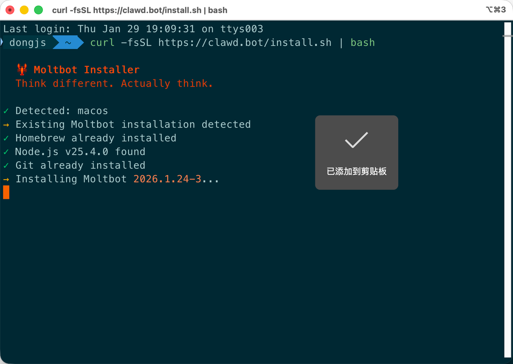

# Clawdbot 安装及接入飞书

> 来源: 飞书云文档 (X30SdZNVRobbRhxUyrRchMT1nSd)

---

## 01｜安装 Clawdbot

```bash
# Mac
curl -fsSL https://clawd.bot/install.sh | bash

# Windows
iwr -useb https://clawd.bot/install.ps1 | iex
```

选择模型（推荐 Qwen，免费且量大）。

---

## 02｜配置飞书

1. 进入飞书应用中心：https://open.feishu.cn/app
2. 创建企业自建应用
3. 添加机器人能力
4. 获取 App ID 和 App Secret
5. 添加事件：接收消息
6. 设置回调配置：使用长连接
7. 开通权限
8. 发布版本

---

## 03｜连接飞书和 Clawdbot

```bash
# 安装飞书插件
clawdbot plugins install @m1heng-clawd/feishu
```

在 Clawdbot 图形界面设置飞书参数。

---

## 04｜重启

```bash
clawdbot gateway restart
```

---

## 05｜使用

在飞书里搜索机器人名字，给它发消息即可。


## 📷 文档图片


